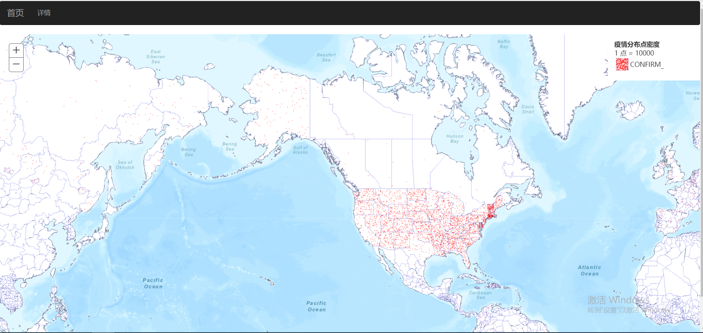
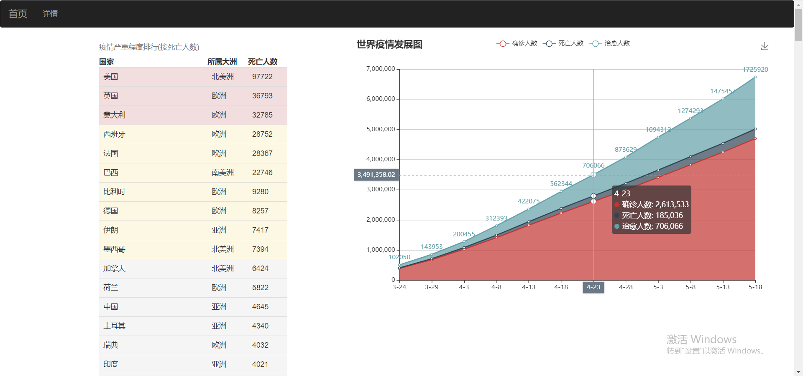

#说明文档

该项目主要使用地图和图表反应疫情的一个形势

整个项目内容不多，就包括两个页面，效果如下

***
###下面具体说说完成该项目用到的知识和关键步骤：
**首先说明一下，该项目没办法把所有内容都放到github上，所以包含所有的代码，其他需要设置的一些东西接下来我会说明**
####需要准备的数据:
* 地图数据(arcgis支持的数据格式即可，我用的shapefile)
* 疫情数据(从网络中抓取)

####涉及知识:
* `爬虫`，用来获取疫情数据，可以从github上找数据接口(很基础即可，会使用代码访问url，能把获取到的网页保存下来就够了，我用的python)
* `arcgis server api for js`，在地图中使用了要素图层的相关知识，将疫情状况以点密度专题图的形式表现出来
* `javascript`，本身arcgisserver的api就用的js，同时图表的显示都用的是js动态生成
* `Echarts`，右侧的图表使用Echarts生成的（百度的开源图表库，很有名的）
* `Bootstrap`，页面布局使用了Bootstrap(也就使用了一个导航栏，简单了解一下就会用了，直接找一个现成的也行)，表格的样式也用的是BootStrap

####具体步骤
1.获取数据
* 疫情数据: 使用python爬取，`get_now_data.py`是获取实时数据，`get_time_data.py`是获取时间序列数据，从3-24到5-19号，中间可能有些数据缺失，不过不影响大局,都存放在`data`文件夹下备用
* 地图数据: 使用的是世界地图的shp数据，自己从网上找找，注意不要找那些对台湾以及南海地区有争议的地图，谨记！！！

2.将疫情数据录入到地图数据的属性表中
* 录入数据有很多种方式，可以自己灵活选择，我是用python27(按装arcgis for desktop自带的)的arcpy模块读取属性表和疫情数据并更新属性表
* `fill_data.py`就是对应代码

3.将录入数据完成后的地图数据发布为要素地图服务
* 要下载`arcgis server`, 网上教程很多，不在详说

4.编写网页
* 页面布局: 先用Bootstrap构建页面布局，想好每一块应该放什么内容
* 地图: 使用了之前发布的要素地图服务，使用了点密度渲染器(arcgis server api for js实现), js文件在`js/arcgis/`路径下
* 图表 
    * 左侧表格使用Bootstrap的表格样式，使用原生js创建元素，添加bootstrap类实现，数据来自网络的实时数据，主要使用ajax获取数据。代码为`js/echarts/table.js`
    * 右侧表格使用ajax获取数据，Echarts渲染数据, 代码为`js/echarts/chart.js`
***
    

